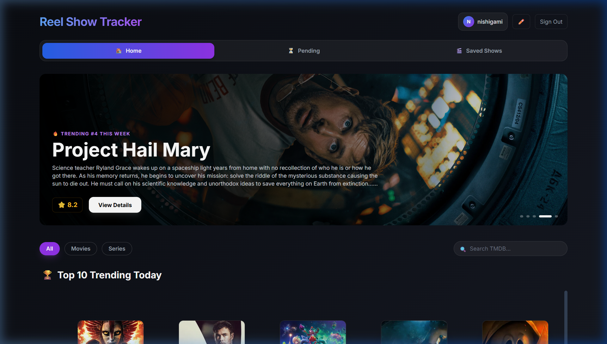
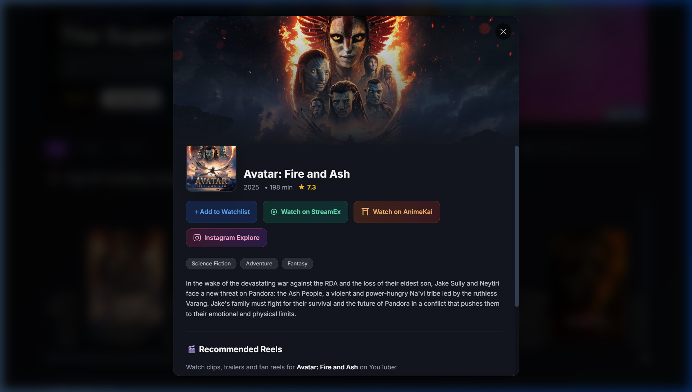
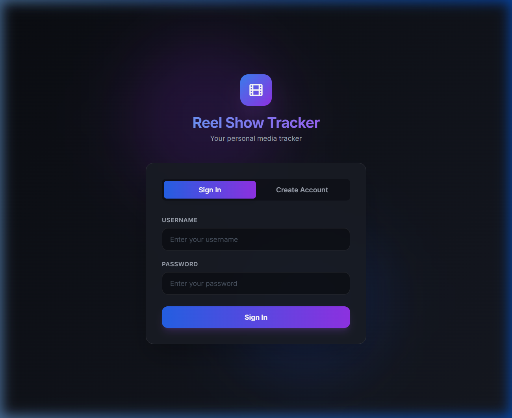

<p align="center">
  
</p>
<p align="center">
  
  
</p>

<h1 align="center">🎬 Reel Show Tracker</h1>

<p align="center">
  <strong>Your personal media watchlist — powered by Instagram Reels, TMDB, and OMDb.</strong>
</p>

<p align="center">
  <a href="https://reel-show-tracker.vercel.app">🌐 Live Demo</a> •
  <a href="#-features">Features</a> •
  <a href="#-tech-stack">Tech Stack</a> •
  <a href="#-getting-started">Setup</a> •
  <a href="#-architecture">Architecture</a>
</p>

---

## 📖 About

Reel Show Tracker is a full-stack, multi-user media management platform that lets you discover, save, and organize movies and TV series. Browse trending titles via TMDB, submit Instagram reel links to auto-detect shows via OMDb, and manage your personal watchlist with status tracking, genre filtering, and more — all wrapped in a premium dark-themed UI.

## ✨ Features

### 🏠 Home — Discover & Browse
- **Hero Slideshow** — Auto-rotating banner showcasing the top 5 trending titles with backdrop art, ratings, and manual navigation
- **Top 10 Trending** — Netflix-style numbered ranking row with large poster cards
- **Popular & Top Rated** — Horizontally scrollable rows for movies and series, with hover-to-reveal details
- **Search** — Live search across TMDB's multi-million title database with debounced input
- **Type Filters** — Toggle between All / Movies / Series across every row

### 🎬 Saved Shows & Streaming
- **Free Streaming Integration** — Direct one-click redirection links inside the Detail Modal to instantly watch movies and series on free streaming platforms (like StreamEx and AnimeKai)
- **Status Tracking** — Organize shows by: `Watching`, `On-Hold`, `Planning`, `Completed`, `Dropped`
- **Genre Filtering** — Dynamic genre chips auto-generated from your library
- **Type Filtering** — Filter by Movies or Series
- **Show Detail Modal** — Rich detail view with poster, plot, ratings, YouTube trailer links, and streaming buttons
- **Quick Status Update** — Dropdown menu on each card to change status instantly
- **Remove Shows** — Delete titles from your watchlist

### ⏳ Pending Reels — Instagram Integration
- **Submit Reel Links** — Paste any Instagram reel URL containing a show/movie recommendation
- **Auto-Detection** — Backend extracts the title from the reel caption and fetches details from OMDb
- **Confirm / Reject** — Review pending reels and confirm to add to your watchlist, or reject to discard

### 🔐 Authentication
- **Multi-User Support** — Each user has their own isolated watchlist and pending reels
- **Account Creation** — Sign up with a username and password
- **Profile Editing** — Update username or password from within the app
- **Persistent Sessions** — Login state stored in `localStorage`

### 🧩 Chrome Extension
- **Automatic Capture** — Content script runs on Instagram reel pages, extracts the caption, and submits it to the backend automatically
- **Zero Friction** — Just browse Instagram reels naturally — the extension handles the rest

## 🛠 Tech Stack

| Layer | Technology |
|-------|-----------|
| **Frontend** | React 18, Tailwind CSS, React DOM Portals |
| **Backend** | Node.js, Express.js |
| **Database** | Google Sheets (via Google Sheets API v4) |
| **APIs** | [TMDB](https://www.themoviedb.org/) (discover/search), [OMDb](https://www.omdbapi.com/) (show details) |
| **Auth** | Custom username/password (stored in Google Sheets) |
| **Extension** | Chrome Extension (Manifest V3) |
| **Deployment** | Frontend on [Vercel](https://vercel.com), Backend on [Render](https://render.com) |

## 📁 Project Structure

```
reel-show-tracker/
├── backend/
│   ├── server.js                 # Express server entrypoint
│   ├── routes/
│   │   ├── authRoutes.js         # Login, register, profile update
│   │   ├── showRoutes.js         # Confirm, reject, save, remove, status update
│   │   └── reelRoutes.js         # Submit and fetch pending reels
│   ├── services/
│   │   ├── googleSheetService.js # CRUD operations on Google Sheets
│   │   ├── showDetailsService.js # OMDb title lookup
│   │   ├── identifyService.js    # Title extraction from captions
│   │   └── reelService.js        # Reel processing logic
│   ├── utils/
│   │   ├── extractTitle.js       # Caption → title parser
│   │   └── extractMeta.js        # Metadata extraction
│   └── package.json
│
├── frontend/
│   └── src/
│       ├── App.js                # Main app with routing & state
│       ├── components/
│       │   ├── HomePage.js       # TMDB browsing (hero, rows, search)
│       │   ├── ShowCard.js       # Watchlist item card with actions
│       │   ├── ShowList.js       # Pending reels list
│       │   ├── ShowDetailModal.js# Full show detail popup
│       │   ├── SubmitForm.js     # Reel link submission form
│       │   ├── LoginPage.js      # Auth screen
│       │   └── EditProfileModal.js # Profile editing dialog
│       ├── context/
│       │   └── AuthContext.js    # Auth state provider
│       └── services/
│           ├── api.js            # Backend API client
│           └── tmdb.js           # TMDB API client
│
├── extension/
│   ├── manifest.json             # Chrome extension manifest (V3)
│   ├── content.js                # Instagram reel caption scraper
│   └── background.js             # Extension service worker
│
└── render.yaml                   # Render deployment config
```

## 🚀 Getting Started

### Prerequisites

- **Node.js** v18+
- **Google Cloud** service account with Sheets API enabled
- **API Keys**: [TMDB](https://www.themoviedb.org/settings/api) and [OMDb](https://www.omdbapi.com/apikey.aspx)

### 1. Clone the repo

```bash
git clone https://github.com/Utkarsh6358/reel-show-tracker.git
cd reel-show-tracker
```

### 2. Set up Google Sheets

1. Create a Google Cloud service account and download the `credentials.json`
2. Create a Google Spreadsheet with three sheets:
   - `Users` — Columns: `userId | username | password | createdAt`
   - `PendingReels` — Columns: `id | reelLink | caption | timestamp | userId`
   - `ConfirmedShows` — Columns: `title | genre | plot | rating | type | reelLink | timestamp | poster | status | userId`
3. Share the spreadsheet with the service account email (Editor access)

### 3. Backend setup

```bash
cd backend
npm install
```

Create a `.env` file:

```env
SHEET_ID=your_google_sheet_id
OMDB_KEY=your_omdb_api_key
GOOGLE_CREDENTIALS_JSON=base64_encoded_credentials_json
```

> **Note:** For local development, you can place `credentials.json` directly in `backend/` instead of using the base64 env var.

Start the server:

```bash
npm start
# Server runs on http://localhost:5000
```

### 4. Frontend setup

```bash
cd frontend
npm install
```

Create a `.env` file:

```env
REACT_APP_API_URL=http://localhost:5000
REACT_APP_OMDB_KEY=your_omdb_api_key
REACT_APP_TMDB_KEY=your_tmdb_api_key
```

Start the dev server:

```bash
npm start
# App runs on http://localhost:3000
```

### 5. Chrome Extension (optional)

1. Open `chrome://extensions` in Chrome
2. Enable **Developer mode**
3. Click **Load unpacked** and select the `extension/` folder
4. Browse Instagram reels — captions are auto-submitted to your backend

## 🏗 Architecture

```
┌──────────────────┐     ┌──────────────────┐     ┌──────────────────┐
│                  │     │                  │     │                  │
│  React Frontend  │────▶│  Express Backend  │────▶│  Google Sheets   │
│  (Vercel)        │     │  (Render)        │     │  (Database)      │
│                  │◀────│                  │◀────│                  │
└──────────────────┘     └────────┬─────────┘     └──────────────────┘
        │                        │
        │                        │
        ▼                        ▼
┌──────────────────┐     ┌──────────────────┐
│                  │     │                  │
│  TMDB API        │     │  OMDb API        │
│  (Discover)      │     │  (Show Details)  │
│                  │     │                  │
└──────────────────┘     └──────────────────┘

┌──────────────────┐
│                  │
│  Chrome Extension│─────▶ Backend /api/reels/submit
│  (Instagram)     │
│                  │
└──────────────────┘
```

## 🔑 API Endpoints

### Auth
| Method | Endpoint | Description |
|--------|----------|-------------|
| `POST` | `/api/auth/register` | Create a new account |
| `POST` | `/api/auth/login` | Log in |
| `POST` | `/api/auth/update-profile` | Update username/password |

### Shows
| Method | Endpoint | Description |
|--------|----------|-------------|
| `GET` | `/api/shows/history` | Get user's saved shows |
| `POST` | `/api/shows/confirm/:id` | Confirm a pending reel → save to watchlist |
| `POST` | `/api/shows/reject/:id` | Reject a pending reel |
| `POST` | `/api/shows/save-direct` | Save a show directly (from TMDB browse) |
| `POST` | `/api/shows/history/update-status` | Change show status |
| `POST` | `/api/shows/history/remove` | Remove a show |

### Reels
| Method | Endpoint | Description |
|--------|----------|-------------|
| `GET` | `/api/reels/pending` | Get pending reels for a user |
| `POST` | `/api/reels/submit` | Submit a new reel link |

## 🌐 Deployment

The app is configured for deployment via `render.yaml`:

- **Backend** → [Render](https://render.com) Web Service (Node.js)
- **Frontend** → [Vercel](https://vercel.com) (or Render Static Site)

### Environment Variables

#### Backend (Render)
| Variable | Description |
|----------|-------------|
| `NODE_ENV` | `production` |
| `SHEET_ID` | Google Spreadsheet ID |
| `OMDB_KEY` | OMDb API key |
| `GOOGLE_CREDENTIALS_JSON` | Base64-encoded service account credentials |

#### Frontend (Vercel)
| Variable | Description |
|----------|-------------|
| `REACT_APP_API_URL` | Backend URL (e.g., `https://reel-tracker-backend.onrender.com`) |
| `REACT_APP_OMDB_KEY` | OMDb API key |
| `REACT_APP_TMDB_KEY` | TMDB API key |

## 📜 License

This project is licensed under the ISC License.

---

<p align="center">
  Built with ❤️ by <a href="https://github.com/Utkarsh6358">Utkarsh</a>
</p>
